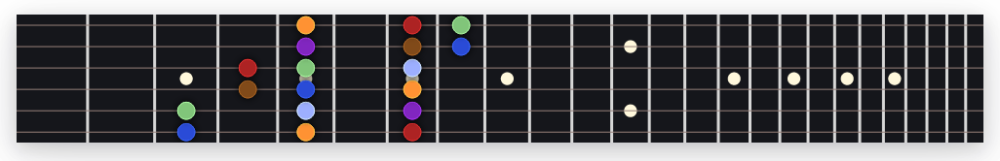

# Guitar Scales Trainer

Link to app: [Guitar Scales Trainer](https://bluenote10.github.io/guitar-scales-trainer/)

This is a small app that helps to master the guitar fretboard by visualizing various scales and
patterns. The exercises force you to visualize different aspects of a scale, like horizontally
or vertically related scales, musically related scales, and so on. The idea is to challenge the
brain in all sorts of different ways to gain a deeper understanding of the guitar fretboard. The
exercises are randomly generated to make to practice all aspects equally, and avoiding to become
for instance only familiar with moving a scale upwards, but not downwards. All exercises can be
done without a guitar, but of course if can even be more effective to practice the scale along
on the instrument to add muscle memory to the process.
